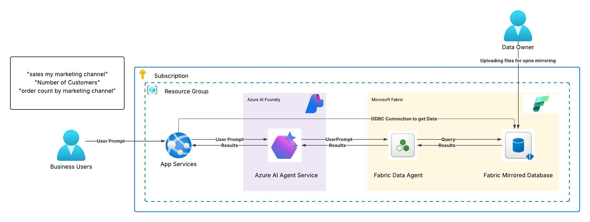

# Project AutoLake
Legacy sales systems often break downstream data pipelines whenever schemas change—causing delays, report failures, and manual rework.
Project AutoLake uses Microsoft Fabric Open Mirroring to eliminate data pipeline maintenance entirely.
Schema and data changes from source systems are detected automatically and reflected in the Lakehouse within minutes.
A Fabric Data Agent is then connected to Azure AI Agent Service, enabling natural language queries and real-time analytics without rebuilding models or ETL processes.
This delivers zero downtime, zero pipelines, and instant business insights—all with lower operational overhead.

Repo to show Open mirroring in Fabric and then  chat with your data using Fabric Agent and Azure AI agent Service and show data in Front end in Grid

## Architecture Overview



## 🚀 Project Setup Guide – AutoLake (Fabric Open Mirroring + AI Agent)

### 📂 1. Create Initial Data Files

1. Set up **Azure SQL Database** (or SQL Server) and restore the **AdventureWorksLT** sample database.
2. Open **Azure Data Studio**, connect to the database.
3. Export the following tables as `.csv` files:
   - `Customer`
   - `Product`
   - `SalesOrderDetail`
   - `SalesOrderHeader`

---

### 💠 2. Configure Microsoft Fabric & Open Mirroring

1. In Azure Portal → Create a **Fabric Capacity (F2 SKU)**.
2. Open **Microsoft Fabric Portal** → **Data Engineering** experience.
3. Create a **Mirrored Database** and name it:

4. Upload the 4 CSV files exported earlier.
- ✅ Fabric Open Mirroring auto-creates tables.
- ✅ Data is replicated and available within minutes.

---

### 🤖 3. Create a Fabric Data Agent

1. Go to **Fabric → Data Factory → AI Data Agent**.
2. Create a new **Data Agent** and select the mirrored database.
3. Include all 4 tables:
- Customer  
- Product  
- SalesOrderDetail  
- SalesOrderHeader  
4. Publish the agent.
5. Test sample questions like:
- `"count of customers"`
- `"number of orders by year"`

---

### 🛠 4. Simulate Schema Change (Add New Column)

Run the following query in Azure SQL to add a new column and populate dummy values:


ALTER TABLE SalesLT.SalesOrderHeader
ADD MarketingChannel NVARCHAR(50) NULL;

UPDATE SalesLT.SalesOrderHeader
SET MarketingChannel =
 CASE
     WHEN SalesOrderID % 3 = 0 THEN 'Email'
     WHEN SalesOrderID % 3 = 1 THEN 'Instagram'
     ELSE 'SEO'
 END;


Export the updated SalesOrderHeader table as CSV again.

Upload it to the Mirrored Database in Fabric.

✅ Select “Update existing table” when uploading.

Wait 1–2 minutes for Fabric to auto-replicate schema & data.

## 5. Refresh Fabric Agent to Reflect New Schema

Open your Fabric Data Agent.

Click Refresh Schema.

Republish the agent so the new MarketingChannel column is available for queries.

Now you can ask:

"Total orders by Marketing Channel"

"Revenue by Marketing Channel"

## 6.  Integrate with Azure AI Agent Service

Go to Azure AI Agent Service → Create New Agent (Region: East US2).

From Fabric Data Agent, copy:

Workspace ID

Artifact ID

## In Azure AI Agent Service:

Add Fabric Agent as a Knowledge Source.

Provide a system message like:

For all user questions related to data, generate SQL and query the connected Fabric Database.


From Fabric → Lakehouse / SQL endpoint → Copy Connection String for your front-end or API.

✅ Final Outcome

✔ Automatic data ingestion using Fabric Open Mirroring
✔ Schema changes detected & replicated within minutes
✔ Fabric Data Agent updated for AI-powered natural language queries
✔ Integrated with Azure AI Agent Service for web/app/Teams chatbot interface

# Fabric Web App

A web application that demonstrates integration between Microsoft Fabric and Azure AI Agents, allowing users to view mirrored SQL data and interact with it through natural language queries.

## Features

- **Data Visualization**: View mirrored Fabric SQL data from AdventureWorksLT database
- **AI-Powered Chat**: Interact with your data using Azure AI Agents
- **Session Management**: Persistent chat history using ASP.NET Core session state
- **Responsive UI**: Modern interface built with Bootstrap 5

## Prerequisites

- .NET 9.0
- Azure Subscription
- Microsoft Fabric Workspace
- Azure AI Project configured with an agent

## Configuration

The application uses the following configurations:

- **Fabric Database Connection**:
  ```csharp
  Server: "Fabric DataBase Coonection String "
  Database: "AdventureWorksLT_Mirrored"

## Azure AI Agent 
Project Endpoint: "Project endpoint"
Agent ID: "Agent ID visible in playground"

Getting Started
Clone the repository
Ensure you have .NET 9.0 SDK installed
Configure Azure credentials (the app uses DefaultAzureCredential)
Run the application

dotnet run


## Features in Detail

Data Viewing
Navigate to "Show Data" page
Select a table from the dropdown
View mirrored data from Fabric SQL database

## Chat Interface
Go to "Agent Chat" page
Ask natural language questions about your data
View chat history persisted through session

## Authentication
The application uses Azure DefaultAzureCredential for authentication with both Fabric SQL Database and Azure AI Services.

Contributing
Fork the repository
Create a feature branch
Commit your changes
Push to the branch
Create a Pull Request
